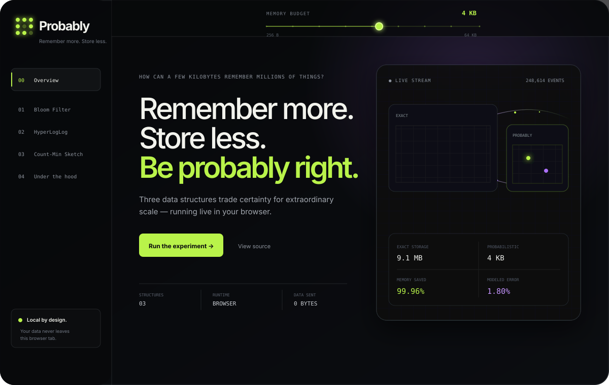

<p align="center">
  
</p>

<h1 align="center">Probably</h1>

<p align="center"><strong>Remember more. Store less. Be probably right.</strong></p>

<p align="center">
  An interactive, browser-native explorer for Bloom Filters, HyperLogLog, and Count-Min Sketch.
</p>

<p align="center">
  <a href="https://darkmatternet.github.io/probably/"><strong>Open the live playground</strong></a>
  ·
  <a href="#how-it-works">How it works</a>
  ·
  <a href="#run-locally">Run locally</a>
</p>

<a href="https://darkmatternet.github.io/probably/">
  
</a>

## How can a few kilobytes remember millions of things?

Exact data structures remember every item. Probabilistic data structures preserve only enough evidence to answer one narrow question—using dramatically less memory in exchange for a controlled amount of uncertainty.

Probably makes that trade-off visible. Every bit, register, estimate, collision, and error metric is produced by the real implementation running locally in the tab.

| Laboratory | Question | What becomes visible |
| --- | --- | --- |
| **Bloom Filter** | Have I seen this before? | Hash routes, bit positions, fill ratio, false-positive probability, and a real false-positive challenge. |
| **HyperLogLog** | How many unique things did we see? | 64-bit hashes, register selection, leading-zero ranks, the register skyline, and estimate error. |
| **Count-Min Sketch** | What appears most often? | Counter collisions, one-sided estimation error, exact-versus-estimated rankings, and matrix pressure. |

A single **memory budget** controls all three experiments, from 256 bytes to 64 kilobytes. Reducing it makes the consequences immediate: more collisions, less precision, and a clearer view of why these structures work.

## Product principles

- **Manipulate, do not merely read.** The explanation is embedded in the interaction.
- **Real algorithms.** There are no precomputed results or decorative charts.
- **Deterministic experiments.** Seeded streams make states reproducible and shareable.
- **Local by design.** No backend, uploads, accounts, analytics, cookies, or runtime CDN.
- **Progressive depth.** Visitors can play first, then inspect formulas and implementation details.
- **Accessible motion.** Keyboard controls, visible focus states, semantic landmarks, live announcements, and `prefers-reduced-motion` support are built in.

## Architecture

Probably is deliberately small and portable: semantic HTML, CSS, and native JavaScript modules. There are **zero production dependencies**.

```text
probably/
├── index.html                 # Semantic application shell
├── styles.css                 # Ordered stylesheet entrypoint
├── styles/                    # Visual system and responsive layers
├── js/
│   ├── app.js                 # Shared memory state, URL state, coordination
│   ├── core/                  # Hashing and probabilistic structures
│   ├── data/                  # Deterministic stream presets
│   └── ui/                    # Hero and laboratory controllers
├── tests/                     # Node built-in test suite
├── scripts/
│   ├── build-site.mjs         # Minimal static deployment bundle
│   └── browser-qa.mjs         # Dependency-free Chromium/CDP smoke QA
└── .github/workflows/pages.yml
```

### Algorithm guarantees

| Structure | Guarantee used by the playground |
| --- | --- |
| Bloom Filter | Negative answers are exact; positive answers may be false positives. Inserted values never become false negatives. |
| HyperLogLog | Duplicate observations do not change cardinality state. Relative standard error is approximately `1.04 / √m`. |
| Count-Min Sketch | Frequency estimates can overestimate due to collisions, but never underestimate under positive updates. |

## Run locally

The app does not need a build step for development. Serve the repository over HTTP so browser module imports work:

```bash
git clone https://github.com/DarkMatterNet/probably.git
cd probably
python3 -m http.server 4173
```

Then open `http://localhost:4173`.

### Quality checks

Node.js 20 or newer is recommended.

```bash
npm test             # deterministic algorithm and state tests
npm run check        # syntax-check every JavaScript module
npm run build        # assemble the exact GitHub Pages artifact
npm run qa:browser   # functional + responsive Chromium QA and screenshots
```

`npm run qa:browser` requires a local Chromium-based browser. Set `CHROMIUM_PATH` when Chromium is not installed in a standard location.

## Shareable state

Memory, active laboratory, and stream seed are encoded in the query string:

```text
?memory=4096&lab=hyperloglog&seed=20260815
```

This keeps experiments reproducible without storing user data.

## Deployment

Every pull request runs the test and syntax suites. A successful push to `main` assembles a minimal `_site` artifact and deploys it through GitHub Pages using GitHub's official Pages actions.

## License

Probably is released under the [MIT License](./LICENSE).

Built by [DarkMatterNet](https://github.com/DarkMatterNet).
